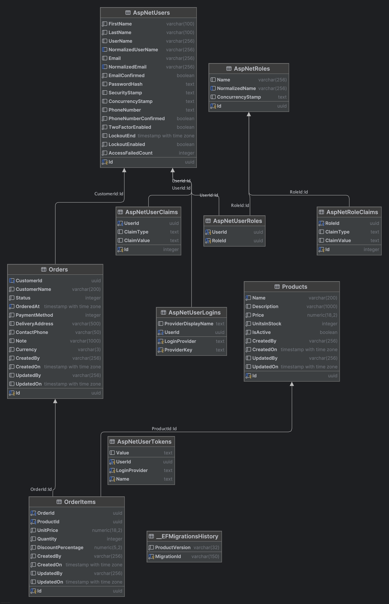

# 🍽️ AbySalto Restaurant API

**ASP.NET Core REST API** for restaurant product catalog and order management. Built with clean architecture, JWT authentication, role-based authorization, PostgreSQL persistence, and interactive Swagger documentation.

[](https://dotnet.microsoft.com/)
[](https://learn.microsoft.com/aspnet/core/)
[](https://www.postgresql.org/)
[](https://learn.microsoft.com/ef/core/)
[](https://www.docker.com/)

## 📚 Table of Contents

- [🗄️ Entity Relationship Diagram](#️-entity-relationship-diagram)
- [✨ Features](#-features)
   - [🔐 Authentication & Authorization](#-authentication--authorization)
   - [🍕 Product Catalog](#-product-catalog)
   - [📦 Order Management](#-order-management)
   - [🛠️ Platform & Developer Experience](#️-platform--developer-experience)
- [📋 Project Scope](#-project-scope)
   - [🎯 Core Requirements (Implemented)](#-core-requirements-implemented)
   - [🚀 Additional Highlights](#-additional-highlights)
   - [🏗️ Architecture & Design](#️-architecture--design)
- [🔌 API Overview](#-api-overview)
- [🛠️ Technologies Used](#️-technologies-used)
   - [Backend](#backend)
   - [Data & Persistence](#data--persistence)
   - [Application Layer](#application-layer)
   - [API & Tooling](#api--tooling)
   - [Testing](#testing)
   - [DevOps](#devops)
- [📋 Prerequisites](#-prerequisites)
- [🚀 Installation](#-installation)
- [🏃‍♂️ Local Development](#️-local-development)
- [🔑 Seeded Accounts (Development)](#-seeded-accounts-development)
- [🧪 Testing](#-testing-1)
   - [Manual — Swagger UI](#manual--swagger-ui)
   - [Automated Tests](#automated-tests)
- [📁 Project Structure](#-project-structure)
- [🚀 Improvements](#-improvements)
   - [Technical](#technical)
   - [API & Features](#api--features)
   - [Security](#security)

## 🗄️ Entity Relationship Diagram

## ✨ Features

### 🔐 Authentication & Authorization

- **User registration & login** with ASP.NET Core Identity
- **JWT Bearer tokens** with configurable issuer, audience, and expiration
- **Role-based access**: `Admin` and `Customer`
- **Account lockout** after failed login attempts
- **Password policies** enforced at registration

### 🍕 Product Catalog

- **Full CRUD** for menu products (Admin)
- **Browse & search** products with pagination (Admin & Customer)
- **Filtering** by active status and name search
- **Sorting** by name, price, stock, active flag, or creation date
- **Stock tracking** with `UnitsInStock` on each product

### 📦 Order Management

- **Create orders** with multiple items and payment details
- **List & filter orders** by status with pagination and sorting
- **Update order status** and delivery information
- **Manage items** — add, update quantity, or remove items on an order
- **Role-based data access** — customers see only their own orders; admins see all
- **Order totals** — per line: `unitPrice × quantity × (1 − discount%)`, then summed for `TotalAmount` (computed on read via `OrderCalculations`, not stored); duplicate `ProductId` rejected in addItemAsync method

### 🛠️ Platform & Developer Experience

- **Clean architecture** — Domain, Application, Infrastructure, and API layers
- **Global exception handling** with consistent JSON error responses
- **FluentValidation** on all request DTOs and list queries
- **AutoMapper** for entity ↔️ DTO mapping
- **Swagger UI** with JWT auth, enum schemas, and request/query examples
- **EF Core migrations** applied automatically on startup (Development)
- **Development seed data** — demo users, menu items, and sample orders (Bogus)
- **Docker Compose** — API + PostgreSQL with health checks

---

## 📋 Project Scope

This API was built as a **complete backend solution** for a restaurant ordering system, with a focus on maintainable structure and security.

### 🎯 Core Requirements (Implemented)

- ✅ **JWT Authentication** — Register, login, and protect endpoints with Bearer tokens
- ✅ **Identity & Roles** — Admin and Customer roles with policy-based authorization
- ✅ **Product Management** — CRUD, search, filter, sort, and pagination
- ✅ **Order Management** — Create, read, update status, and manage order items
- ✅ **PostgreSQL + EF Core** — PostgreSQL database with EF Core migrations
- ✅ **Input Validation** — FluentValidation on create/update requests and list queries
- ✅ **API Documentation** — Swagger - OpenAPI with security scheme and examples
- ✅ **Error Handling** — Centralized middleware error responses
- ✅ **Automated tests** — xUnit unit and integration tests with Testcontainers

### 🚀 Additional Highlights

-  **Repository pattern** — Abstracted data access for products and orders
-  **Paged responses** — Consistent `PagedResponse<T>` for list endpoints
-  **Swagger examples** — Pre-filled request bodies and query parameters for faster testing
-  **Docker support** — Multi-stage Dockerfile and `docker-compose` for local full-stack runs
-  **Demo seed data** — Bogus data for realistic menu and order samples
-  **Order business rules** — Stock checks, status transitions, and customer ownership rules

### 🏗️ Architecture & Design

- **Layered architecture** with clear separation between domain, application, and infrastructure
- **Domain-driven entities** — `Product`, `Order`, `OrderItem`, and Identity users/roles
- **Testable services** — Business logic in `ProductService` and `OrderService`
- **Seeded demo users** — Admin and customer accounts configured in `appsettings.Development.json`

---

## 🔌 API Overview

| Area | Base route | Auth | Notes |
|------|------------|------|-------|
| Auth | `POST /api/auth/register`, `POST /api/auth/login` | Anonymous | Returns JWT access token |
| Products | `GET/POST/PUT/DELETE /api/products` | JWT | POST,PUT,DELETE: Admin only |
| Orders | `GET/POST/PATCH /api/orders` | JWT | Item routes under `/api/orders/{id}/items` |

### Order statuses

`pending` → `inPreparation` → `completed`

Status transitions cannot be skipped or reversed.

### Payment methods

`cash`, `card`, `online`, `digitalWallet`

---

## 🛠️ Technologies Used

### Backend

- **.NET 9** — Target framework
- **ASP.NET Core Web API** — REST API framework
- **ASP.NET Core Identity** — Authentication and roles
- **JWT Bearer Authentication** — Stateless authentication

### Data & Persistence

- **PostgreSQL 16** — Relational database
- **Entity Framework Core 9** — ORM and migrations
- **Npgsql** — PostgreSQL provider for EF Core

### Application Layer

- **AutoMapper 16** — DTO mapping
- **FluentValidation 12** — Request validation
- **Bogus 35** — Development seed data

### API & Tooling

- **Swashbuckle (Swagger) 7** — OpenAPI documentation
- **Microsoft.AspNetCore.OpenApi** — Native OpenAPI support

### Testing

- **xUnit 3** — Unit and integration testing
- **FluentAssertions** — Readable test assertions
- **Moq** — Mocking dependencies for unit tests
- **Microsoft.AspNetCore.Mvc.Testing** — In-memory API testing
- **Testcontainers.PostgreSql** — PostgreSQL containers for integration tests

### DevOps

- **Docker** — Containerized API
- **Docker Compose** — API + PostgreSQL setup with persistent volumes

---

## 📋 Prerequisites

Before you begin, ensure you have the following installed:

- **[.NET SDK 9.0](https://dotnet.microsoft.com/download)** or higher
- **[Docker Desktop](https://www.docker.com/products/docker-desktop/)** (optional, for containerized setup)
- **PostgreSQL 16** (only if running the API locally without Docker)

---

## 🚀 Installation

### 1. Clone the repository

```bash
git clone https://github.com/Petar1107/junior.net.git
cd junior.net
```

### 2. Configure settings (local run)

Development settings in `AbySalto.Junior/appsettings.Development.json`. Defaults include:

- PostgreSQL: `localhost:5432`, database `abysalto`
- JWT secret, issuer, and audience
- Seed user credentials

For production, use User Secrets, environment variables, or a secure secrets manager.

---

## 🏃‍♂️ Local Development

### Option A — Docker Compose (recommended)

Starts PostgreSQL and the API together. Migrations and seed data run on API startup.

```bash
docker compose up -d --build
```

| Service | URL |
|---------|-----|
| API | http://localhost:8080 |
| Swagger UI | http://localhost:8080 *(Development Environment only)* |
| PostgreSQL | localhost:5432 |

### Option B — .NET CLI + local PostgreSQL

1. Start PostgreSQL (or use Docker for the database only):

   ```bash
   docker compose up db -d
   ```

2. Run the API:

   ```bash
   cd AbySalto.Junior
   dotnet run
   ```

3. Open Swagger:

    - HTTP: [http://localhost:5074](http://localhost:5074)
    - HTTPS: [https://localhost:7056](https://localhost:7056)

---

## 🔑 Seeded accounts (Development)

Configured in `appsettings.Development.json`:

| Role | Email | Password |
|------|-------|----------|
| Admin | `admin@example.com` | `Admin123!` |
| Customer | `customer@example.com` | `Customer123!` |

Use **Login** in Swagger (`POST /api/auth/login`), copy the `accessToken`, then click **Authorize** and paste the token (without the `Bearer` prefix).

---

## 🧪 Testing

### Manual — Swagger UI

1. Start the app (Docker or `dotnet run`)
2. Call `POST /api/auth/login` with seeded credentials
3. Authorize with the JWT
4. Try product and order endpoints — examples are pre-filled in Swagger

### Automated tests

The solution includes two xUnit v3 test projects under `tests/`:

| Project | Type | Stack |
|---------|------|--------|
| `AbySalto.Junior.UnitTests` | Unit | Moq, FluentAssertions, FluentValidation test helpers |
| `AbySalto.Junior.IntegrationTests` | Integration | `WebApplicationFactory`, Testcontainers (PostgreSQL), FluentAssertions |

**Unit tests** cover isolated business logic without a database:

- `OrderCalculations` — line totals, discounts, order totals
- `OrderRules` — status transitions and duplicate product checks
- FluentValidation rules for product and order DTOs
- `OrderService.CreateAsync` — throws `BadRequest` when stock is exceeded

**Integration tests** run the API against a temporary PostgreSQL container using the `Testing` environment and `appsettings.Testing.json`.

Covered scenarios include:

- Authentication — valid admin login and invalid password handling
- Orders — order creation, total calculation, and admin status updates

Integration tests use dedicated seeded test credentials:
`admin@test.local` / `Admin123!`

#### Run tests

From the repository root:

```bash
dotnet test
```

Run a single project:

```bash
dotnet test tests/AbySalto.Junior.UnitTests
dotnet test tests/AbySalto.Junior.IntegrationTests
```

**Prerequisites for integration tests:** [.NET SDK 9.0](https://dotnet.microsoft.com/download) and **Docker** running locally (Testcontainers starts PostgreSQL automatically; no manual DB setup).

---

## 📁 Project Structure

```
junior.net/
├── AbySalto.Junior.sln
├── docker-compose.yml
├── Dockerfile
└── AbySalto.Junior/
    ├── Controllers/              # Auth, Products, Orders API endpoints
    ├── Application/
    │   ├── Common/               # Pagination, sort fields, calculations
    │   ├── DTOs/                 # Request/response models
    │   ├── Exceptions/           # HTTP exceptions
    │   ├── MappingProfiles/      # AutoMapper profiles
    │   ├── Services/             # Business logic interfaces & implementations
    │   └── Validators/           # FluentValidation rules
    ├── Domain/
    │   ├── Common/               # BaseEntity
    │   ├── Entities/             # Product, Order, OrderItem, Identity
    │   └── Enums/                # OrderStatus, PaymentMethod, UserRole
    └── Infrastructure/
        ├── Auth/                 # JWT generation & authentication setup
        ├── Database/             # DbContext, migrations, seeders, configurations
        ├── Middleware/           # Global exception handling
        ├── OpenApi/              # Swagger filters and example payloads
        └── Repositories/         # EF Core data access
```
---

## 🚀 Improvements

### Technical

- Automated integration tests with xUnit
- Health check endpoints for orchestrators and load balancers
- Structured logging with Serilog
- GitHub Actions CI pipeline

### API & Features

- Refresh token support
- Order cancellation flow

### Security

- Rate limiting for authentication endpoints
- Secure secret management
- API versioning